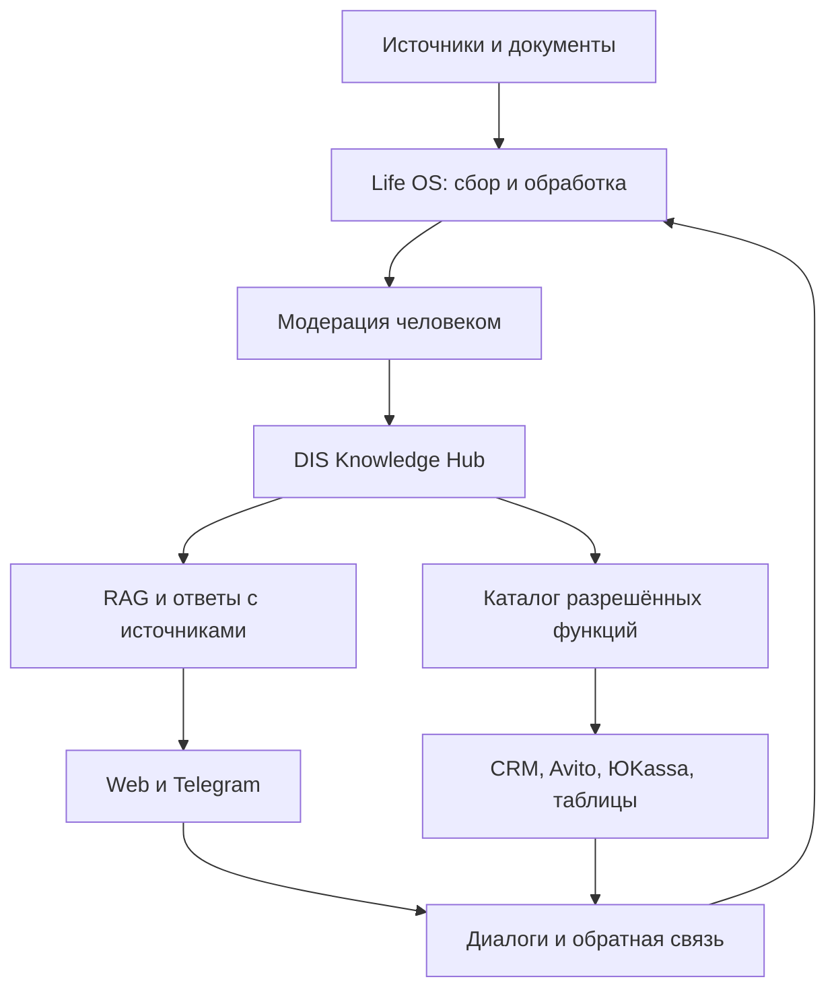

# Мысли и разработки

Рабочая папка для развития собственных продуктов Дмитрия Степанова и сайта st8dom.ru.

> Статус: концепция от 02.09.2026. Подтверждённые возможности отделены от планируемых.

## 1. Основа: Life OS

Репозиторий: https://github.com/dimitry8st-prog/Life-Os

Подтверждённый конвейер:

`URL / PDF / текст / YouTube → извлечение → Claude API → Markdown в Obsidian → SQLite → локальный RAG`

По README уже реализованы классификация, саммари, научный блок, теги, дедупликация SHA-256, журналирование ошибок, TF-IDF-поиск, связи `related`, Streamlit-дашборд и 38 заявленных тестов.

Ограничения: TF-IDF плохо сопоставляет русские словоформы; YouTube зависит от доступности субтитров.

## 2. Собственный продукт: DIS Knowledge Hub

**ДИС** — собственная панель управления AI-ассистентами, базами знаний и разрешёнными действиями. Life OS становится модулем сбора и подготовки знаний внутри общей системы.

### Ценность

Пользователь загружает документы и источники, проверяет подготовленные знания, создаёт ассистента, подключает нужный канал и разрешает только конкретные действия.

### Архитектура

## 3. Модули собственной панели

### Базы знаний

- загрузка PDF, TXT, DOCX, XLSX, PPTX и URL;
- предварительный просмотр извлечённого текста;
- автоматическая и ручная разбивка на блоки;
- метаданные: источник, дата, автор, тема, права доступа;
- версии базы и возможность отката;
- тестовый вопрос до публикации;
- ответы с указанием использованного источника;
- очередь документов, ожидающих проверки.

### Ассистенты

- название, роль и фирменный стиль;
- выбор одной или нескольких баз знаний;
- системная инструкция и ограничения;
- тестовый чат;
- передача сложного вопроса человеку;
- отдельные права на чтение и выполнение действий;
- версии промпта и журнал изменений.

### Каталог функций

Функция — небольшой независимый модуль с чёткими входными и выходными данными. Она не получает полный доступ ко всей системе.

Первые собственные функции:

1. извлечение транскрипции YouTube;
2. создание лида в CRM;
3. добавление строки в Google Таблицу;
4. Telegram-уведомление;
5. поиск по базе знаний;
6. создание черновика документа;
7. приём заявки с Avito;
8. формирование платёжной ссылки ЮKassa;
9. проверка статуса оплаты;
10. передача оператору.

### Интеграции

Интеграции группируются по назначению:

| Группа | Первые подключения |
|---|---|
| AI-модели | OpenAI-compatible API, Claude |
| Каналы | Web-чат, Telegram, Avito |
| Данные | PostgreSQL, SQLite, Obsidian, Google Таблицы |
| CRM | Bitrix24, amoCRM или универсальный webhook |
| Платежи | ЮKassa |
| Автоматизация | n8n как внешний оркестратор, если он действительно нужен |

## 4. Идеи для интерфейса собственной платформы

Базовые элементы будущего интерфейса:

- единая панель «Базы знаний»;
- каталог функций с поиском и фильтрами;
- карточки подключений;
- быстрый тест базы;
- тарифные ограничения;
- понятные формы настройки каналов.

Улучшение относительно показанного интерфейса: вместо полей, постоянно отображающих секреты, использовать кнопку подключения, маскированное значение, проверку соединения, дату последней успешной проверки и отзыв доступа.

## 5. Avito и ЮKassa

### Avito — планируемый модуль

Возможный сценарий:

`новое обращение → определение намерения → поиск ответа в базе → черновик ответа → оператор или CRM`

Требования:

- использовать официальный способ авторизации и только необходимые разрешения;
- учитывать ограничения и доступность API для конкретного аккаунта;
- не отправлять необратимые ответы без режима согласования на пилоте;
- исключать дубли обращений;
- сохранять связь между диалогом и лидом.

### ЮKassa — планируемый модуль

Возможный сценарий:

`согласованная услуга → платёжная ссылка → подтверждение оплаты → уведомление → запуск следующего этапа`

Правила:

- AI не определяет сумму самостоятельно;
- платёж создаётся только из утверждённого заказа;
- подтверждением считается серверное событие и дополнительная проверка статуса;
- обработчик событий должен быть идемпотентным;
- возврат и изменение суммы требуют подтверждения человека;
- секреты не попадают в браузер, логи или GitHub.

## 6. Минимальный MVP

В первую версию не нужно переносить весь каталог большой платформы.

Включить:

1. авторизацию администратора;
2. одну базу знаний;
3. загрузку PDF, DOCX, TXT и URL;
4. обработку через Life OS;
5. ручное одобрение материалов;
6. семантический поиск;
7. web-чат с Дисом;
8. ответы с источниками;
9. Telegram-эскалацию;
10. тестовый набор и журнал ошибок.

Не включать в первую версию: биллинг, магазин функций, 1С, многопользовательские тарифы и автоматическую публикацию ответов в Avito.

## 7. Техническая основа

Предварительный стек, который согласуется с существующими проектами:

- FastAPI — API и панель;
- PostgreSQL — пользователи, документы, диалоги, разрешения;
- pgvector или отдельный векторный слой — семантический поиск;
- Redis + очередь задач — обработка больших документов;
- S3-совместимое хранилище — исходные файлы;
- React/Next.js либо простой серверный интерфейс — панель;
- Life OS — извлечение и подготовка знаний;
- Docker Compose — локальный запуск;
- n8n — только для внешних бизнес-процессов, а не как ядро продукта.

## 8. Безопасность

- секреты хранятся зашифрованно на сервере;
- интерфейс показывает только последние символы ключа;
- кнопки «Проверить подключение», «Отключить» и «Обновить ключ»;
- права выдаются отдельно каждой функции;
- критические действия требуют подтверждения;
- журналируются вызов, результат и инициатор без раскрытия секрета;
- персональные и медицинские данные не загружаются без отдельного защищённого контура;
- доступ можно отозвать без удаления всей системы.

## 9. Новый кейс для st8dom.ru

Рабочее название:

**DIS Knowledge Hub: собственная платформа знаний и AI-интеграций**

Подача кейса:

1. проблема — знания и подключения разбросаны;
2. решение — Life OS готовит знания, ДИС управляет базой, диалогами и функциями;
3. демонстрация — документ → проверка → вопрос → ответ с источником;
4. доказательства — репозиторий, тесты, видео и контрольный набор;
5. честный статус — концепция, затем прототип и готовность к пилоту;
6. развитие — Telegram, Avito, CRM и ЮKassa.

## 10. Очередь разработок

### Этап 1 — проектирование

- [ ] утвердить название продукта;
- [ ] описать пользователей и роли;
- [ ] определить схему данных;
- [ ] зафиксировать контракт между Life OS и Knowledge Hub;
- [ ] подготовить 20 контрольных вопросов;
- [ ] создать кликабельный макет панели.

### Этап 2 — база знаний

- [ ] импорт документов;
- [ ] модерация;
- [ ] семантический поиск;
- [ ] ссылки на источники;
- [ ] версии и откат;
- [ ] оценка качества RAG.

### Этап 3 — действия

- [ ] Telegram;
- [ ] универсальный webhook;
- [ ] CRM;
- [ ] Avito после проверки официальных условий доступа;
- [ ] ЮKassa после проектирования заказа и платёжных состояний.

## 11. Критерий готовности пилота

Система на контрольном наборе использует только одобренные материалы, показывает источник, отказывается при отсутствии данных, не выполняет критические действия без разрешения и оставляет проверяемый журнал событий.
