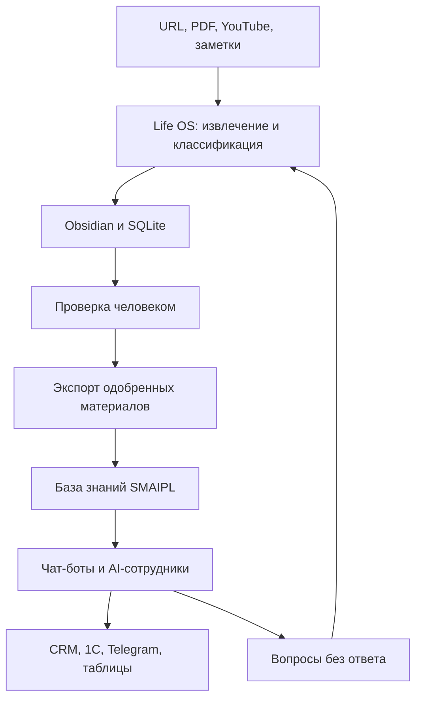

# Мысли и разработки

Рабочая папка для идей по развитию st8dom.ru и связанных AI-проектов.

> Статус документа: концепция. Здесь отделены уже подтверждённые возможности от будущих гипотез.

## 1. Подтверждённые компоненты

### Life OS

Репозиторий: https://github.com/dimitry8st-prog/Life-Os

Существующий конвейер:

`URL / PDF / текст / YouTube → извлечение → Claude API → Markdown в Obsidian → SQLite → локальный RAG`

Проверяемые особенности из README:

- классификация, саммари, научный блок и теги;
- защита существующих заметок от перезаписи;
- дедупликация по SHA-256;
- журналирование ошибок;
- локальный поиск TF-IDF и связи `related`;
- Streamlit-дашборд;
- 38 заявленных автоматических тестов.

Ограничения: TF-IDF плохо сопоставляет разные словоформы; YouTube зависит от доступности субтитров.

### SMAIPL

По предоставленным скриншотам платформа позволяет:

- создавать базы знаний из PDF, TXT, XLSX, DOCX и PPTX;
- настраивать разделитель и размер блоков;
- тестировать базу знаний;
- подключать готовые функции и интеграции, включая YouTube, 1С, CRM, Airtable, Google Таблицы и Telegram.

Это наблюдение по интерфейсу, а не утверждение о разработке SMAIPL Дмитрием.

## 2. Как использовать Life OS и SMAIPL совместно

Рекомендуемая модель: **Life OS готовит и контролирует знания, SMAIPL использует их в бизнес-ассистентах и интеграциях.**

### Разделение ответственности

| Компонент | Основная роль |
|---|---|
| Life OS | Собирать источники, очищать, классифицировать, связывать и хранить личные знания |
| Человек | Проверять факты, права доступа, теги и допуск материала к публикации |
| SMAIPL | Давать бизнес-пользователям доступ к одобренным знаниям и выполнять внешние действия |
| st8dom.ru | Показывать кейс, демонстрацию и предлагать пилот клиенту |

## 3. Минимальный совместный пилот

1. Выбрать одну тему, например «AI-автоматизация бизнеса».
2. Собрать через Life OS 30–50 открытых материалов.
3. Провести ручную проверку и отметить одобренные заметки.
4. Экспортировать только одобренные материалы в отдельную папку.
5. Загрузить экспорт в тестовую базу знаний SMAIPL.
6. Подготовить 20 контрольных вопросов, включая вопросы без ответа.
7. Проверить полноту, наличие источников, отказы и передачу человеку.
8. Записать короткую демонстрацию для вкладки «Кейсы».

Критерий готовности пилота: система отвечает только по допущенным материалам, показывает источник и честно отказывается при отсутствии данных.

## 4. Варианты продукта

### Личный исследовательский контур

Life OS собирает статьи и видео, а SMAIPL предоставляет удобный диалог и функции. Подходит эксперту, консультанту или преподавателю.

### Корпоративная база знаний

Life OS выступает подготовительным конвейером, после ручной модерации знания передаются ассистенту сотрудников в SMAIPL.

### Контент-лаборатория

Life OS выявляет связанные идеи и формирует основу материалов; SMAIPL запускает согласованные действия: таблица, Telegram, CRM или публикационный workflow.

### Контур улучшения базы

Неотвеченные запросы из SMAIPL возвращаются в очередь Life OS как темы для поиска и пополнения знаний. Автоматическое добавление без проверки запрещено.

## 5. Новый кейс для st8dom.ru

Рабочее название:

**Life OS + AI-база знаний: от источника до проверяемого ответа**

Структура страницы:

1. Проблема: материалы разбросаны между сайтами, PDF, видео и заметками.
2. Решение: Life OS собирает и структурирует данные; SMAIPL предоставляет интерфейс и интеграции.
3. Демонстрация: источник → заметка → одобрение → база → ответ.
4. Что проверено: тесты Life OS и контрольный набор вопросов.
5. Ограничения: это прототип интеграции, не клиентское внедрение.
6. Следующий шаг: пилот на одной теме и 30–50 материалах.

## 6. Очередь разработок

### Сейчас

- [ ] определить формат экспорта из Life OS;
- [ ] проверить, принимает ли SMAIPL Markdown напрямую;
- [ ] описать правила ручной модерации;
- [ ] собрать контрольные вопросы;
- [ ] проверить работу на русских словоформах.

### Далее

- [ ] заменить или дополнить TF-IDF семантическими эмбеддингами;
- [ ] сохранять источник и дату обновления в метаданных;
- [ ] добавить версионирование базы;
- [ ] организовать журнал ответов без лишних персональных данных;
- [ ] возвращать неотвеченные вопросы в очередь исследования;
- [ ] подготовить видео и скриншоты для кейса.

## 7. Риски и правила

- Не передавать в облачную систему персональные или медицинские данные без отдельного правового и технического контура.
- Не публиковать материалы без проверки авторских прав.
- Не смешивать личные заметки Obsidian с корпоративной базой.
- Не выдавать вывод модели за подтверждённый факт.
- Не заявлять SMAIPL как собственную разработку.
- Не называть совместную схему внедрённой до реального end-to-end теста.
